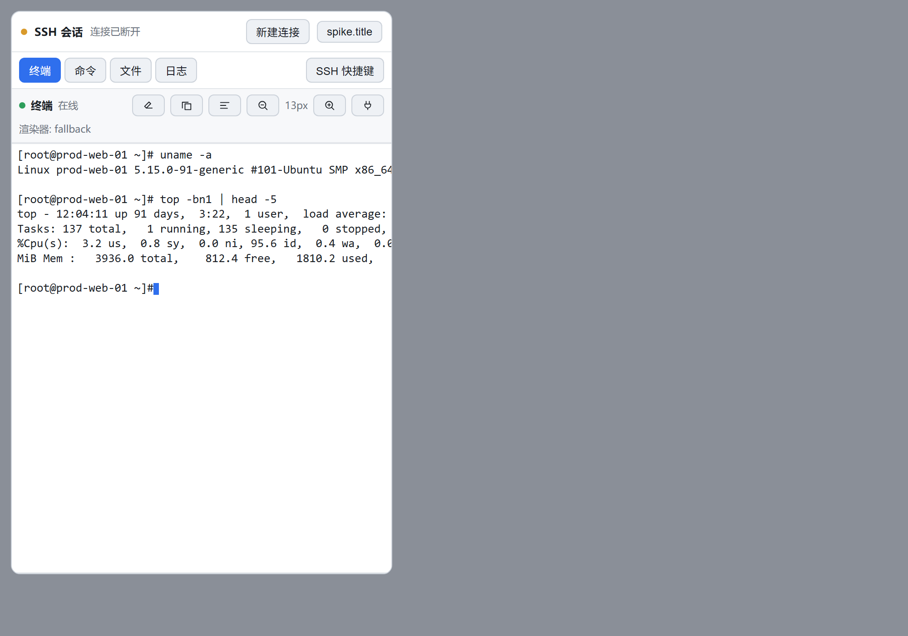
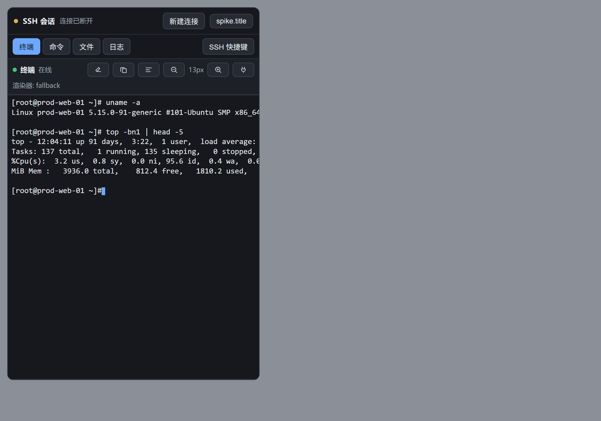
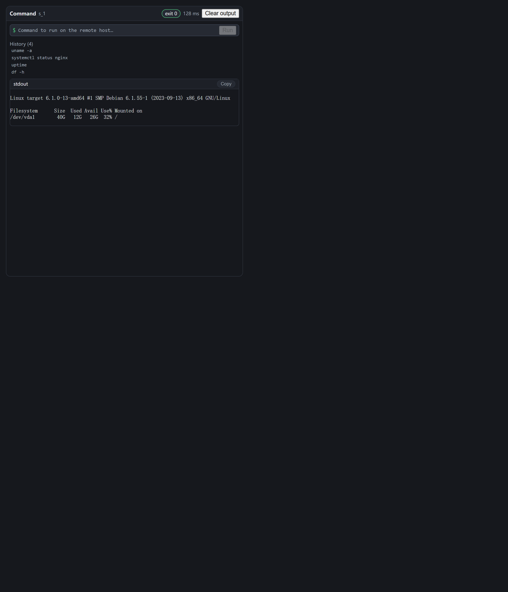
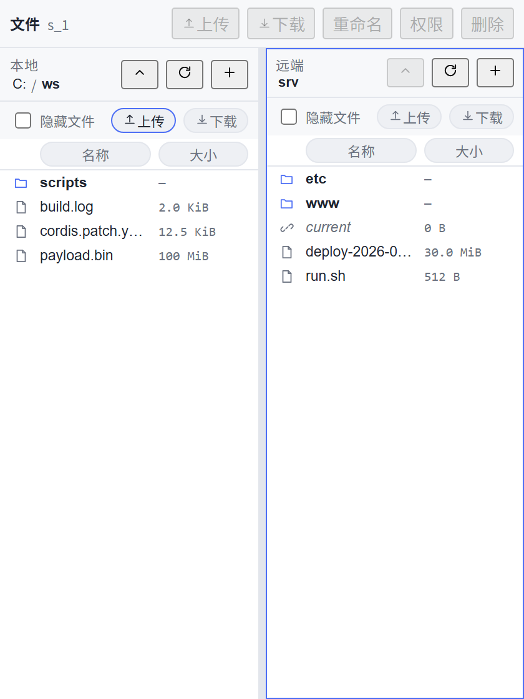
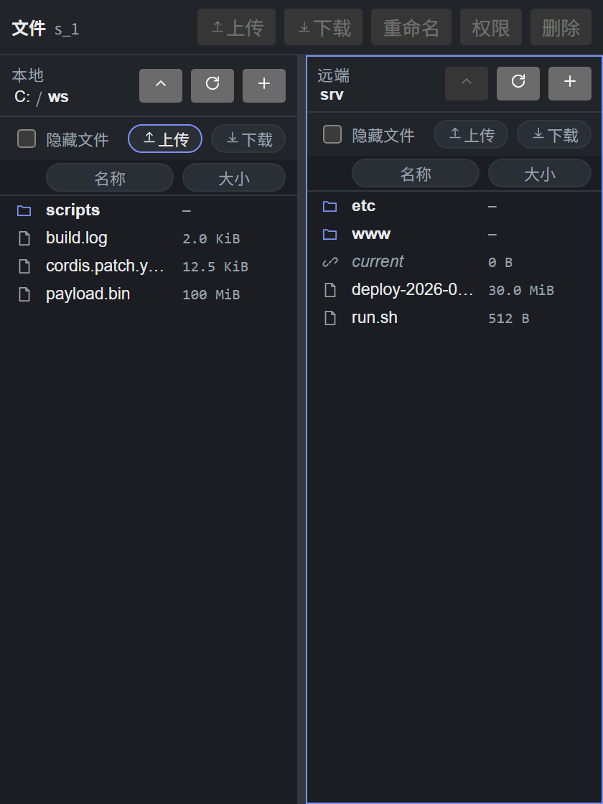

# @local/dsh-ssh · DSH SSH 插件

在 DSH 右侧边栏里管理 SSH 连接：连接档案、多会话工作区（终端 / 命令 / 文件 / 日志）、SFTP 传输、审计日志，并同时以 Agent 工具的形式暴露给模型。

- **host 半边**：Node + Cordis 插件（`src/**` → `lib/**`），用 `ssh2` 实现连接池、命令执行、PTY 与 SFTP。
- **client 半边**：自包含懒加载 bundle（`client/src/**` → `lib/client.js`，唯一外部依赖 `react`），注册右侧栏标签与面板，主题全部走 `--dsw-*` token。
- **文档**：`docs/DESIGN.md`（总体设计）、`docs/ICD.md`（冻结接口契约 v1.0.x）、`docs/M0-SPIKE.md`（传输实测）、`docs/TESTING.md`（分层测试与运行命令）、`docs/DEMO.md`（验收走查）、`docs/REAL-TARGET.md`（真机信息，不含密码）。

---

## 1. 安装

前置：DSH 桌面版（自带 Node ≥ 20）。本包是**免重启**装载的本地插件。

```powershell
# 1) 让 profile 依赖指向本仓库（link: 形式，改代码即生效）
node scripts/profile-install.mjs --step deps      # 写 profile package.json（带备份）
#    …按提示在 profile 目录执行一次 pnpm install（或让脚本代为执行）
# 2) 在 profile 的 cordis.patch.yml 里插入本插件的托管块
node scripts/profile-install.mjs --step patch
# 3) 查看状态 / 回滚
node scripts/profile-install.mjs --status
node scripts/profile-install.mjs --uninstall
```

要点（M0 实测结论，见 `docs/M0-SPIKE.md`）：

- profile 的 `cordis.patch.yml` 是**共写文件**，只能通过 `# >>> dsh-ssh >>>` 标记块增删；**禁止整文件重写**。
- **不要**同时把本包加进 `dsh.profile.bundles`（会产生重复行）。
- host 侧改动要重跑 `apply()` 时，用 `plugin_manager` 把 `include:dsh-ssh` 行 toggle 关→开（`entryId` 是 `include:dsh-ssh`）；改 `client/src/**` 必须重建 `lib/client.js`，**页面只在该文件字节变化时重新执行 apply()**。

## 2. 配置

全部配置项与默认值在 `cordis.patch.yml`（ICD §6）。常用项：

| 配置 | 默认 | 说明 |
|---|---|---|
| `maxSessions` | `10` | 并发会话上限（与"10 会话并发"验收对齐） |
| `connectTimeoutMs` / `operationTimeoutMs` | `15000` / `120000` | 建连 / 单次操作超时 |
| `graceKillMs` | `3000` | `timeoutMs` 到期后 SIGTERM → SIGKILL 的宽限 |
| `keepaliveIntervalMs` / `keepaliveCountMax` | `20000` / `3` | 心跳与判死阈值（连续失败 → `SSH_TIMEOUT_IDLE`） |
| `retries` | `2 / 500 / 5000 / true` | 仅对 `retryable` 错误重试，指数退避 + 抖动 |
| `hostKey.policy` | `accept-new` | `strict`（首连必须人工确认）/ `accept-new` / `insecure` |
| `hostKey.knownHostsFile` | `''` → `<DSH_HOME>/known_hosts` | OpenSSH 兼容；支持 `|1|salt|hmac` 哈希条目 |
| `sftp.chunkBytes` / `maxConcurrentChunks` | `262144` / `4` | 分块大小与并发分块数 |
| `sftp.resume` / `sftp.verify` | `true` / `size+mtime` | 断点续传与校验（`none`/`size+mtime`/`sha256`） |
| `secrets.provider` / `envPrefix` | `credentials` / `DSH_SSH_` | 凭据来源；环境变量优先级最高且**只读** |
| `logging.redact` / `redactKeys` | `true` / `[…]` | 三层脱敏中的日志层 |
| `maxOutputBytes` | `262144` | 单命令输出上限（超限保留头尾并置 `truncated`） |
| `ui.defaultWidthPx` / `terminalFontSize` | `420` / `13` | 侧栏宽度与终端字号 |

**凭据**永远不落配置文件：密码/passphrase 走 `ctx.credentials`，或用一次性内存凭据（`connect` 的 `secrets`），或 `DSH_SSH_<PROFILE_SLUG>_PASSWORD` 环境变量（只读、UI 显示 `source:'env'`）。UI 与日志中只会出现固定 8 个圆点的掩码。

## 3. UI 使用

> **实测状态（2026-09-27，真实浏览器 + 真机 `203.0.113.10`）**：连接与**交互式终端已端到端打通** —— console 首行 marker `ssh-client-2026-09-26.4-console-clean`，`rpc stream sshPlugin/openShell` 打开，逐键 `shellWrite {"data":"l"/"s"/" "/"-"/"a"/"\r"}` **全部 `ok`**，终端有提示符且 `ls -a` 有真实输出，console 无未捕获错误。host 日志：`connected to root@203.0.113.10:22 in 712ms (auth=password(••••••••), hostKey=accept-new)`。原文与复现方法见 `docs/ACCEPTANCE.md` §11。
> **十条验收标准全部通过（用户 2026-09-27 实机走查）**：GUI 内 `top` 全屏、**文件页签的目录导航（进入/`..` 返回）、上传（`rpc stream sshPlugin/upload` + 传输条进度）、下载（`download open` + 6938 B 文件落地）**、多会话标签与亮/暗主题切换，均已实测通过。逐条原话与 console/host 日志见 `docs/ACCEPTANCE.md` §11.7/§11.8。
> **证据边界（如实）**：100 MiB 级传输的闭环在引擎/工具层（真机 100.0 MiB 实测）；UI 侧实测为小文件（6938 B），**不宣称**“UI 端完成 100 MiB 传输”。
> **平台限制**：当前桌面端组合**无凭据服务**（`"persisted": false, "reason": "no credentials service in this composition"`），密码只存在于会话内存，**每次重启 DSH 需重新输入**；属平台能力缺失，非插件缺陷。

1. 打开右侧栏：点侧栏底部 **SSH** 动作（`sidebar.footer.action`），或会话输入框左侧的 SSH 图标；`Ctrl/Cmd+Shift+S` 亦可。
2. **新建连接**（`Ctrl/Cmd+T`）：填 名称 / 主机 / 端口 / 用户 / 认证方式；测试连接（`conn.test`）会显示延迟、服务端 banner 与主机密钥指纹。
3. 首次连接：策略为 `strict` 时弹指纹确认；`accept-new` 自动记住到 `known_hosts`；指纹变化一定触发二次确认（`SSH_HOSTKEY_MISMATCH`）。
4. 连接后进入**会话工作区**，四个标签：
   - **终端**：真 PTY，跑 `top`/`vim` 等全屏程序正常，支持复制粘贴、清屏、字号、重连；
   - **命令**：单命令 stdout/stderr/退出码/耗时，历史上下翻；
   - **文件**：远端目录浏览、上传/下载（进度、断点续传、校验）、新建/重命名/删除/chmod；
   - **日志**：本会话审计（脱敏后），可导出。
5. 多会话标签（`Ctrl/Cmd+1..9` 跳转、`Ctrl/Cmd+W` 关闭并二次确认），状态栏显示延迟、连接时长、流量。
6. 断开：状态栏 `断开`，或关标签。快捷键总表见 ICD §8.4。

## 4. Agent 工具

`allowAgentTools: true`（默认）时向模型暴露：`ssh_exec`、`ssh_upload`、`ssh_download`、`ssh_list_dir`、`ssh_sessions`。工具名与 `cordis.patch.yml` 的 `tools` 列表一致（单测断言两者相等）。

## 5. FAQ

**Q. 面板是空的 / 标签打不开？**
先看侧栏 SSH 标签内的诊断条：它显示客户端解析出的传输通道（`carrier`）。`carrier: unresolved` 表示浏览器→host 的通道都没命中；此时 host 侧仍可正常，问题在页面。诊断记录写在 `<DSH_HOME>/logs/dsh-ssh/client-transport.json`。

**Q. 改了代码但界面没变？**
- 改 `client/src/**` → `node scripts/build-client.mjs`；**只有 `lib/client.js` 字节变化时页面才会重新 apply()**。
- 改 `src/**`（host）→ 需要 toggle `include:dsh-ssh` 行（`plugin_manager` 关再开）以重跑 `apply()`。本会话禁止重启 DSH。
- 改配置值 → 同样需要 toggle 行。

**Q. `pnpm install` 报 `cpu-features` 构建被跳过？**
非致命：`ssh2` 自动回退纯 JS 加密。本机实测仍有 30 MiB/s 上传、20 MiB/s 下载（`docs/TESTING.md` 有实测数字）。

**Q. 连接超时/一直转圈？**
看错误码：`SSH_NET_REFUSED`（端口拒绝）、`SSH_NET_DNS`（域名解析失败）、`SSH_TIMEOUT_CONNECT`（建连超时，可调 `connectTimeoutMs`）、`SSH_TIMEOUT_IDLE`（keepalive 连续失败，链路已死）。`retryable: true` 的错误会自动退避重试。

**Q. 为什么没有跳板机 / 端口转发 / 密钥生成？**
本期非目标（见 `docs/DESIGN.md` §1）。密钥可用系统 `ssh-keygen` 生成后在档案里选私钥文件。

**Q. 传输中断了要重传吗？**
不用：`sftp.resume: true` 时续传，`resumedFrom` 回带；`verify: 'sha256'` 会在传输后比对，不一致报 `SSH_SFTP_VERIFY_MISMATCH`（可续传重试）。

**Q. 测试怎么跑？**
见 `docs/TESTING.md`：`node scripts/verify-all.mjs`（一键 lint + 类型 + 构建 + 单测 + 组件 + 集成 + E2E + 性能），真机层用 `--real` + `DSH_SSH_TEST_REAL_*` 显式开启。

## 6. 开发

```powershell
node node_modules/typescript/bin/tsc -p tsconfig.json --noEmit   # 类型（第一道门）
node scripts/lint.mjs                                            # lint
node scripts/build-client.mjs && node scripts/build-client.mjs --check   # 客户端产物 + 确定性
node --test --test-concurrency=1 --test-force-exit "test/unit/*.test.mjs"        # host 单测
node --test --test-concurrency=1 --test-force-exit "test/client/*.test.mjs"      # 组件
node --test --test-concurrency=1 --test-force-exit "test/integration/*.test.mjs" # 集成（本地 sshd 靶机）
node test/e2e/run.mjs                                            # 无头 E2E 走查
node scripts/verify-all.mjs                                      # 全部（每层硬超时）
```

**同一时刻只允许一份全仓测试在跑**（ICD §12 R9）：并发跑会让某个文件看起来"卡住"。`verify-all` 会先自检并在检测到另一份测试运行时拒绝启动（除非 `--allow-concurrent`）。

## 7. 截图

`docs/img/` 下是组件测试与真机走查用的界面截图（亮/暗各一套）：

| 亮色 | 暗色 |
|---|---|
|  |  |
|  |  |
|  |  |
|  |  |

## 8. 自测结果

（本节由交付者维护，见 `docs/TESTING.md` 的"自测结果"小节，含逐层命令、结果与已知缺口。）
